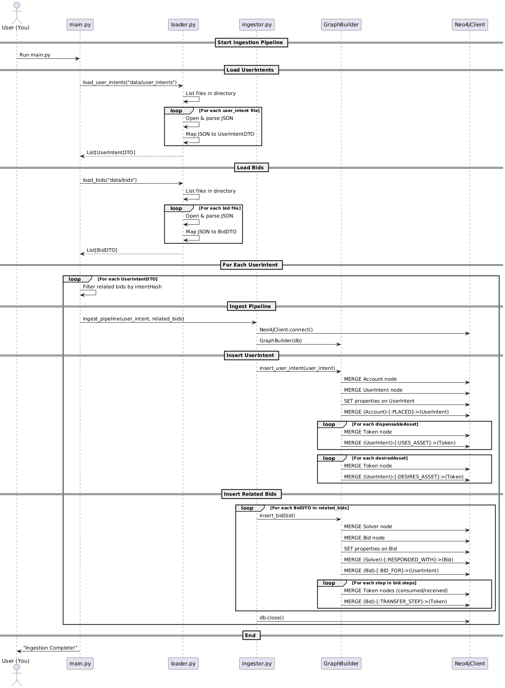

# Chain Abstraction Graph Builder (Neo4j)

A clean and modular pipeline to ingest `UserIntent` and `Bid` JSON data into a Neo4j Knowledge Graph. This enables multi-hop traversal, reasoning, and GraphRAG integration for AI/LLM agents.

## 🔧 Tech Stack
- Python 3.10+
- Neo4j 5.x
- No external dependencies (uses only `neo4j` driver)

## 📐 Data Model (Neo4j)

**Nodes:**
- `Account { address }`
- `UserIntent { intentHash, status, ... }`
- `Bid { bidHash, status, pathSummary, ... }`
- `Solver { address }`
- `Token { address }`

**Relationships:**
- `(Account)-[:PLACED]->(UserIntent)`
- `(Solver)-[:RESPONDED_WITH]->(Bid)`
- `(Bid)-[:BID_FOR]->(UserIntent)`
- `(UserIntent)-[:USES_ASSET]->(Token)`
- `(UserIntent)-[:DESIRES_ASSET]->(Token)`
- `(Bid)-[:TRANSFER_STEP { action, amount, sequence }]->(Token)`

## ✅ Why Knowledge Graph (vs MongoDB)?
- Multi-hop traversal: `Bid → Intent → Account`
- Subgraph reasoning for LLMs
- Directional relationships (e.g. `RESPONDED_WITH`)
- Natural for path finding, solver trust scoring, traceability

## 🛠️ Installation & Setup

1. **Install Python dependencies:**
   ```bash
   uv pip install -r requirements.txt
   ```
   This will install the required Python packages, including the Neo4j driver.

2. **(Optional) Use Makefile for convenience:**
   You can use the provided Makefile to automate setup and ingestion:
   ```bash
   make install      # Installs dependencies
   make start-db     # Starts Neo4j with Docker Compose
   make ingest       # Runs the ingestion script
   make run-all      # Installs, starts DB, and runs ingestion in one step
   ```

3. **Ensure Docker is installed:**
   Docker is required to run Neo4j using Docker Compose.

4. **Check your Neo4j credentials:**
   Make sure the password in `sample_run.py` matches the one set in your `docker-compose.yml`.


## 🚀 How to Run - Standalone Ingestion test Script

1. **Start Neo4j with Docker Compose:**
   ```bash
   docker-compose up -d
   ```
   This will start the Neo4j database in the background.

2. **Check Neo4j startup logs to ensure it started successfully:**
   ```bash
   docker logs --follow neo4j-graph
   ```
   Look for a line like `Remote interface available at http://localhost:7474/` which indicates Neo4j is ready.

3. **Run the main ingestion script:**
   ```bash
   make run
   ```

4. Start API Layer for REST Calls

```bash
uvicorn api.cypher-api:app --reload
```

## 🧩 Data Concepts

### What is a UserIntent?

A **UserIntent** represents a user's desired action or transaction in the system. It captures the user's requirements, constraints, and preferences for an operation (such as a token swap or transfer). Each `UserIntent` is uniquely identified by an `intentHash`.

**Key Fields:**
- `intentHash`: Unique identifier for the intent.
- `intentStatus`: Current status (e.g., `BID_SUBMITTED`).
- `account`: The address of the user who created the intent.
- `userIntent.core.permittedAccounts`: List of accounts allowed to act on this intent.
- `userIntent.constraints`: Constraints such as permitted chains, deadline, max gas, slippage, desired assets, and dispensable assets.
- `createdAt`, `updatedAt`: Timestamps for creation and updates.

**Example:**
```json
{
  "intentHash": "0x0ed5c65e5ef42fa996298fcb22592f3be1b44b1dfd6edba839879463f554838e",
  "intentStatus": "BID_SUBMITTED",
  "account": "0x448b47F358dA18749529bDeAeC26322E58D13177",
  "userIntent": {
    "core": {
      "permittedAccounts": [
        { "account": "0x23F04522a2ec5a8b188C48c18edAE54005b537a3", "chainId": 8453 }
      ]
    },
    "constraints": {
      "permittedChains": [42161],
      "deadline": 1751304211,
      "maxGas": 6000000,
      "slippagePercentage": 5.0,
      "desiredAssets": [
        { "asset": "0xfdfff924c413a228c9fc62b1978ed8f755d81111", "value": "500000000000000000000", "chainId": 8453 }
      ],
      "dispensableAssets": [
        { "asset": "0xaf88d065e77c8cc2239327c5edb3a432268e5831", "maxValue": "100000", "chainId": 42161 }
      ]
    }
  },
  "createdAt": "2025-06-30T17:22:33.914788126"
}
```

### What is a Bid?

A **Bid** is a response to a `UserIntent` from a solver or service provider. It proposes a way to fulfill the user's intent, including the steps and assets involved. Each `Bid` is uniquely identified by a `bidHash` and references the `intentHash` it is responding to.

**Key Fields:**
- `bidHash`: Unique identifier for the bid.
- `intentHash`: The `UserIntent` this bid is for.
- `solverAddress`: Address of the solver making the bid.
- `smartWalletAddress`: Address of the smart wallet used.
- `bidStatus`: Status of the bid (e.g., `PENDING`).
- `bid.steps`: Sequence of actions (with tokens, amounts, and actions).
- `createdAt`, `updatedAt`: Timestamps for creation and updates.

**Example:**
```json
{
  "bidHash": "0xc999e8523aa6400c4d2421e26ab51d8100f6a3df83b1ccbdfcf8a04b91129baf",
  "intentHash": "0x0ed5c65e5ef42fa996298fcb22592f3be1b44b1dfd6edba839879463f554838e",
  "solverAddress": "0x7C84F10502FcDea2E403b70feA96a4aE990a34DF",
  "smartWalletAddress": "0x23F04522a2ec5a8b188C48c18edAE54005b537a3",
  "bidStatus": "PENDING",
  "bid": {
    "steps": [
      {
        "sequenceNumber": 1,
        "chainId": 8453,
        "solution": {
          "to": "0xfdfff924c413a228c9fc62b1978ed8f755d81111",
          "callData": "...",
          "value": "0",
          "path": {
            "tokenConsumed": "0xfdfff924c413a228c9fc62b1978ed8f755d81111",
            "amountConsumed": "500000000000000000000",
            "tokenReceived": "0xfdfff924c413a228c9fc62b1978ed8f755d81111",
            "amountReceived": "500000000000000000000",
            "action": "TRANSFER"
          }
        }
      }
    ]
  },
  "createdAt": "2025-06-30T17:22:36.791050721"
}
```

### Relationship

- Each `UserIntent` can have **multiple Bids** from different solvers.
- Each `Bid` references the `intentHash` of the `UserIntent` it is responding to.
- In the graph, this is modeled as:  
  `(Account)-[:PLACED]->(UserIntent)<-[:BID_FOR]-(Bid)<-[:RESPONDED_WITH]-(Solver)`

This structure enables efficient multi-hop traversal, reasoning, and traceability in the knowledge graph.

## Sequence Diagram

